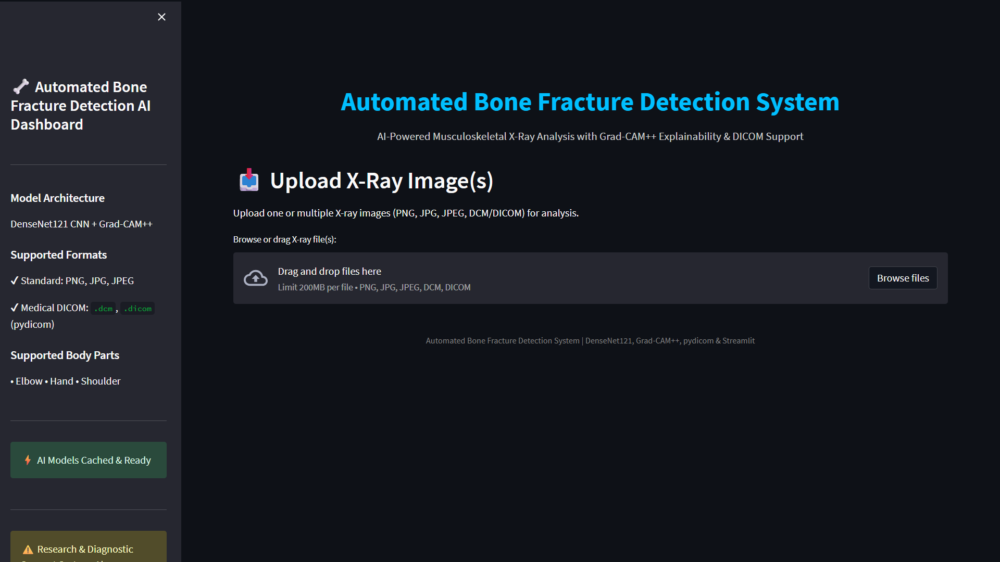
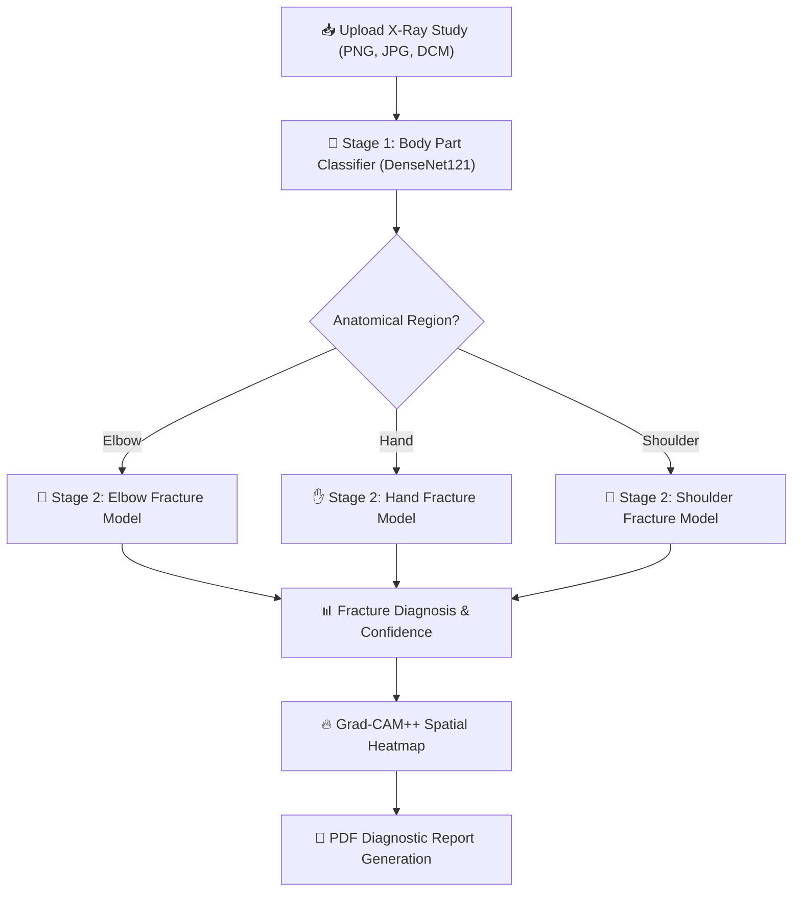
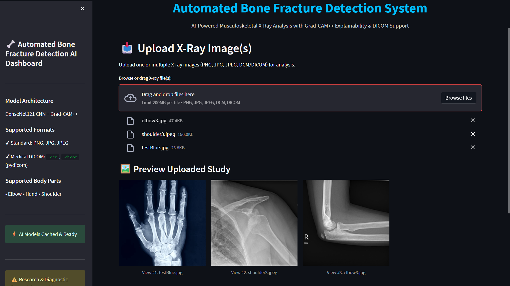
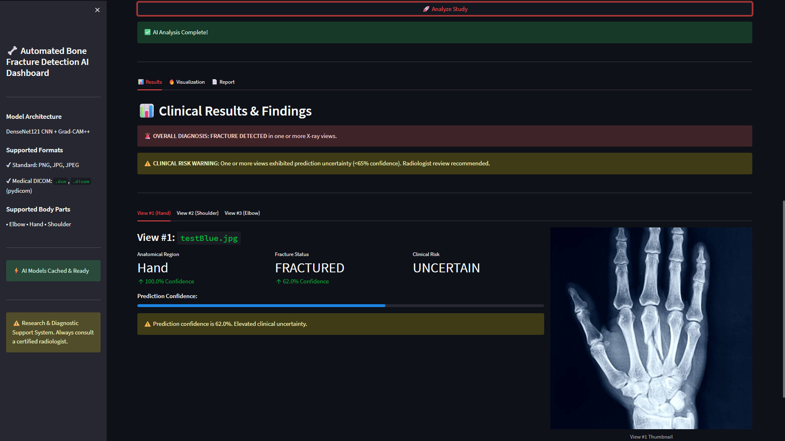
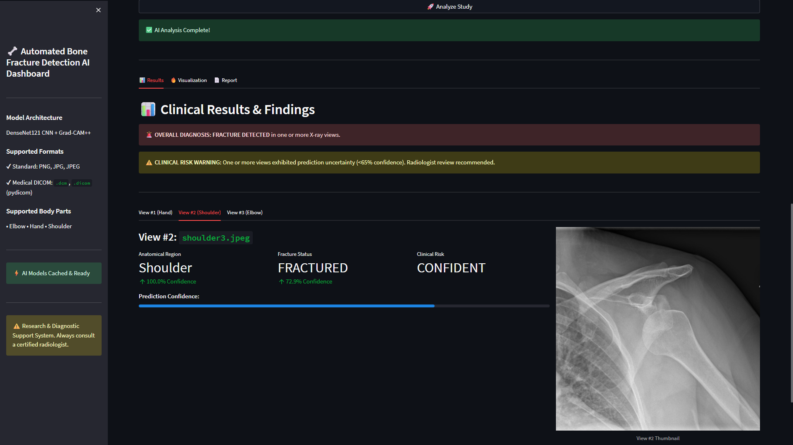
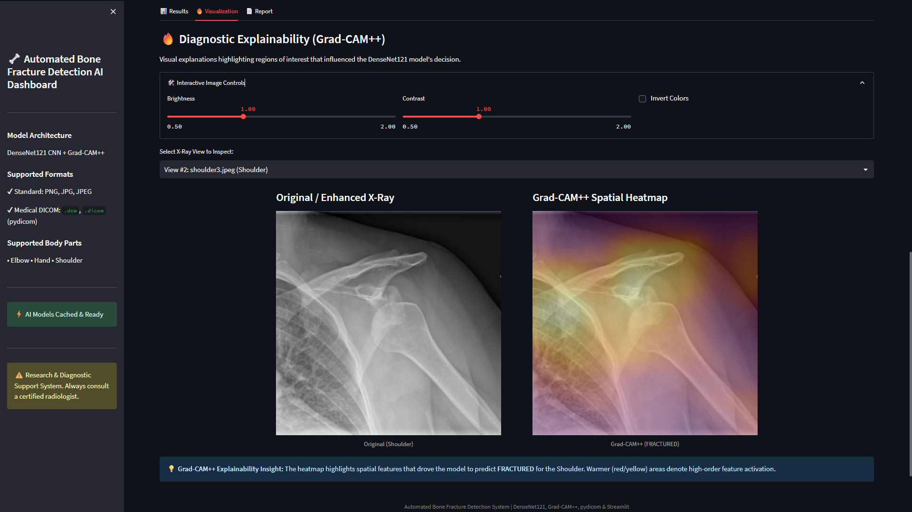
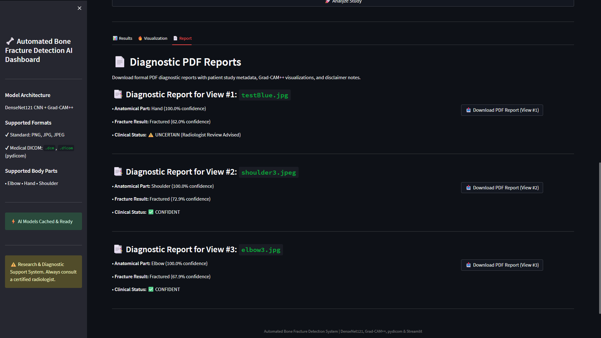
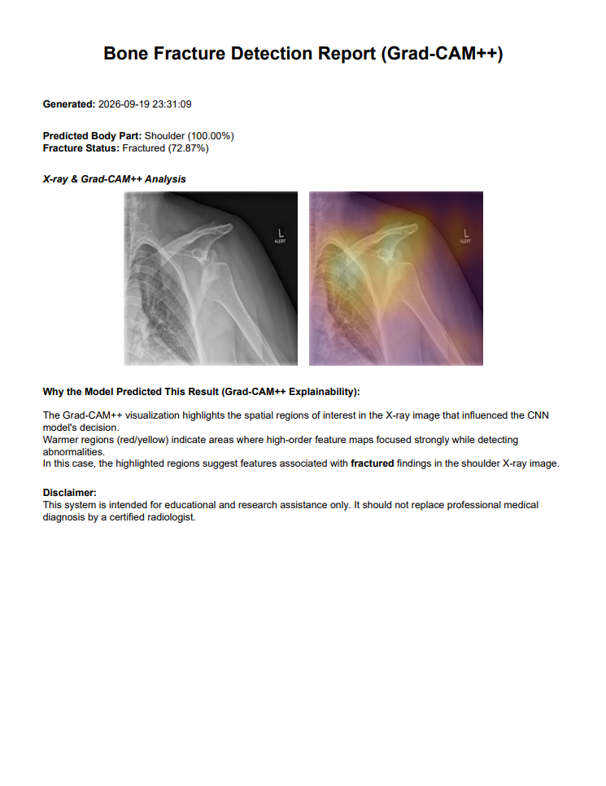

# 🦴 Automated Bone Fracture Detection System (Grad-CAM++)


An advanced AI-powered **Bone Fracture Detection System** that automatically classifies musculoskeletal X-ray images into anatomical regions (*Elbow, Hand, Shoulder*) and performs high-precision fracture detection using specialized deep learning models (**DenseNet121**). The system features **Grad-CAM++ explainability**, **DICOM medical image support**, **clinical uncertainty quantification**, and automated **PDF report generation**.

  
---

## 📌 Project Overview

This system implements a two-stage deep learning pipeline designed to assist radiologists and clinicians:



### 🎯 Pipeline Breakdown

1. **Stage 1: Body Part Classification**  
   Classifies the incoming X-ray into one of 3 supported anatomical regions:
   - 🦾 **Elbow**
   - ✋ **Hand**
   - 🦴 **Shoulder**

2. **Stage 2: Specialized Fracture Detection**  
   Routes the X-ray to a dedicated **DenseNet121** model trained specifically for that anatomical region to output a binary classification (*Normal* vs *Fractured*) alongside confidence percentages and uncertainty flags.

3. **Explainability & Reporting**  
   Generates **Grad-CAM++ spatial heatmaps** to highlight high-order feature activation areas driving the AI prediction and generates downloadable **PDF reports**.

---

## ✨ Key Features

- 🧠 **Hybrid DenseNet121 Deep Learning Engine:** High-accuracy model pipeline leveraging multi-stage CNN architectures.
- 🩻 **Fracture Detection for Elbow, Hand & Shoulder X-rays:** Dedicated DenseNet121 models classify each anatomical region as **Fractured** or **Normal** with optimized performance.
- 📊 **Confidence Score Display:** Displays prediction confidence for both body part classification and fracture detection, helping users interpret model certainty.
- 🔥 **Grad-CAM Heatmap Visualization:** Generates explainable AI heatmaps that highlight the regions influencing the fracture prediction for better interpretability.
- ⚡ **Real-Time X-ray Analysis:** Performs end-to-end inference within seconds, from image upload to fracture prediction and visualization.
- 💾 **Medical DICOM Support:** Full compatibility with standard formats (`.png`, `.jpg`, `.jpeg`) and medical DICOM format (`.dcm`, `.dicom`) via `pydicom`.
- 🖼️ **Multi-View Study Analysis:** Upload and evaluate single or multi-view X-ray studies simultaneously with normalized `300x300` thumbnail previews.
- 🌐**Interactive Streamlit Web Interface:** User-friendly three-page web application with:
  - **`📊 Results`**: Overall study diagnosis, anatomical part confidence, fracture classification, and clinical risk warnings.
  - **`🔥 Visualization`**: Side-by-side normalized view of the Original/Enhanced X-Ray vs **Grad-CAM++ Heatmap** with interactive brightness, contrast, and color inversion sliders.
  - **`📄 Report`**: Comprehensive study breakdown and direct downloadable PDF diagnostic reports.
- 📄 **PDF Report Generation:** Automatically generates professional diagnostic reports containing predictions, confidence scores, Grad-CAM visualizations, and study details.
- 🛠️ **Clinical Uncertainty Quantification:** Highlights predictions below 65% confidence to advise radiologist manual verification.
- 🖥️ **Desktop GUI Support:** Alternative offline desktop application built with CustomTkinter.

---

## 📊 Model Architecture & Performance Metrics

The system uses specialized **DenseNet121** transfer learning architectures evaluated on the **Stanford MURA** dataset.

### 1. Body Part Classification Model

| Metric | Value |
| :--- | :---: |
| **Architecture** | DenseNet121 |
| **Classes** | Elbow, Hand, Shoulder |
| **Accuracy** | **99.87%** |
| **Macro AUC** | **1.000** |

### 2. Specialized Fracture Detection Models

| Anatomical AI Model | Accuracy | Precision | Recall | F1-Score | AUC |
| :--- | :---: | :---: | :---: | :---: | :---: |
| 🦾 **Elbow Fracture** | **87.53%** | 88.05% | 86.52% | **87.30%** | **0.939** |
| ✋ **Hand Fracture** | **85.87%** | 86.47% | 77.78% | **81.90%** | **0.927** |
| 🦴 **Shoulder Fracture** | **89.05%** | 87.54% | 90.44% | **88.95%** | **0.948** |

---

## 📂 Project Structure

```text
Automated-Bone-Fracture-Detection/
│
├── core/                       # Core Machine Learning & Image Engine
│   ├── config.py               # Constants, model file mapping & thresholds
│   ├── gradcam.py              # Grad-CAM++ heatmap calculation & overlay engine
│   ├── pdf_report.py           # ReportLab PDF generation module
│   ├── predictions.py          # Prediction pipeline & uncertainty logic
│   └── preprocessing.py        # DICOM reader, ROI cropping, CLAHE enhancement
│
├── web/                        # Web Application Interface
│   └── app.py                  # Streamlit web app 
│
├── desktop/                    # Desktop Application Interface
│   └── mainGUI.py              # CustomTkinter Desktop GUI app
│
├── weights/                    # Trained Deep Learning Model Weights
│   ├── DenseNet121_BodyParts_best.keras
│   ├── DenseNet121_Elbow_best.keras
│   ├── DenseNet121_Hand_best.keras
│   └── DenseNet121_Shoulder_best.keras
│
├── evaluate_models.py          # Evaluation & metrics calculation script
├── training_fracture.py        # Fracture models training pipeline
├── training_parts.py           # Body parts model training pipeline
├── prediction_test.py          # Test the models
├── requirements.txt            # Python dependencies manifest
└── README.md                   # Project documentation
```

--- 

## 🗂 Dataset Information

This project is trained and validated on the **MURA (Musculoskeletal Radiographs)** dataset by Stanford University.

- **Source:** Stanford ML Group
- **Dataset Type:** Musculoskeletal Radiographs
- **Categories Utilized:** Elbow, Hand, Shoulder
- **Dataset Link:** [https://stanfordmlgroup.github.io/competitions/mura/](https://stanfordmlgroup.github.io/competitions/mura/)

> *Note: The MURA dataset is not included in the repository due to license and file size constraints.*

---

## 🛠 Installation & Setup Guide

### 1. Clone the Repository

```bash
git clone https://github.com/YOUR_USERNAME/Bone-Fracture-Detection-Using-MURA-Dataset.git
cd Automated-Bone-Fracture-Detection
```

### 2. Create & Activate Virtual Environment

**Windows:**
```powershell
python -m venv venv
.\venv\Scripts\activate
```

**Linux / macOS:**
```bash
python3 -m venv venv
source venv/bin/activate
```

### 3. Install Required Dependencies

```bash
pip install -r requirements.txt
```

---

## ▶️ Running the Applications

### 🌐 Run Streamlit Web Application (Recommended)

```bash
streamlit run web/app.py
```
Open your browser and navigate to: **`http://localhost:8501`**

### 🖥️ Run Desktop GUI Application

```bash
python desktop/mainGUI.py
```

---

## 📸 Application Screenshots

| Uploaded Images | Clinical Results for img 1 |
| :---: | :---: |
|  |  |

| Clinical Results for img  2 | Grad-CAM++ Visualization |
| :---: | :---: |
|  |  |

| Diagnostic Report Download | PDF Report Output | 
| :---: | :---: |
|  |  | 

---

## 🔍 How the System Operates

1. **Upload X-Ray Study:** User uploads one or multiple X-ray files (PNG, JPG, or DICOM `.dcm`).
2. **Normalized Study Preview:** Images are preprocessed and displayed in a uniform grid.
3. **Stage 1 Classification:** The system identifies the body part (*Elbow, Hand, Shoulder*).
4. **Stage 2 Prediction:** The corresponding specialized model predicts fracture status (*Normal* vs *Fractured*).
5. **Clinical Uncertainty Check:** Flags results with confidence < 65% for manual radiologist verification.
6. **Grad-CAM++ Explainability:** Generates visual heatmaps highlighting spatial regions of interest.
7. **Report Export:** Generates an executive PDF report for download.

---

## 🎓 Academic Context

This project was developed as part of an **CSE Specialization in Artificial Intelligence, and Machine Learning**. It illustrates practical applications of **Deep Learning**, **Computer Vision**, and **Explainable AI (XAI)** in medical imaging diagnostics.

---

## 👨‍💻 Author

**Chaitanya Yaragalla**  
- 🐙 **GitHub:** [github.com/chaitanya6512](https://github.com/chaitanya6512)  
- 💼 **LinkedIn:** [linkedin.com/in/chaitanya-yaragalla-7baa21243/](https://www.linkedin.com/in/chaitanya-yaragalla-7baa21243/)

---

> ⚠️ **Medical Disclaimer:** This system is an AI research and diagnostic support prototype. It is intended strictly for educational and assistance purposes and should never replace evaluation by a certified radiologist or medical professional.
